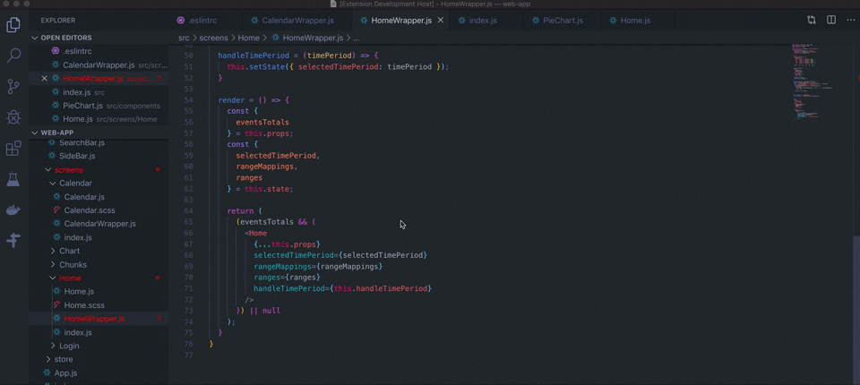

# Prop Trail

Prop Trail is a small but powerful VSCode extension that allows developers to see all references for props that are passed into React Components.

## Features

* Right-click on the desired prop
* Click on the `PROP TRAIL` menu option
* Navigate to the Prop Trail icon in the Activity bar to see all prop references

## Release Notes

### 1.0.0

Initial release of prop-trials.

### 1.0.1

* Change the display name from `prop-trail` to `Prop Trail`.

### 1.0.9

* Update information in README.
* Refactor codebase to remove `v1` directory.
* Address source mapping issues.
